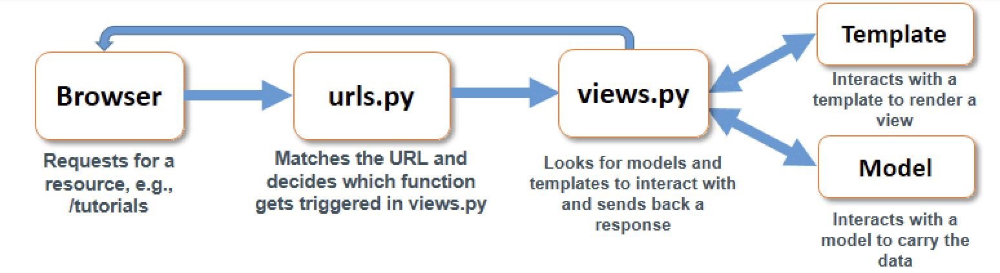
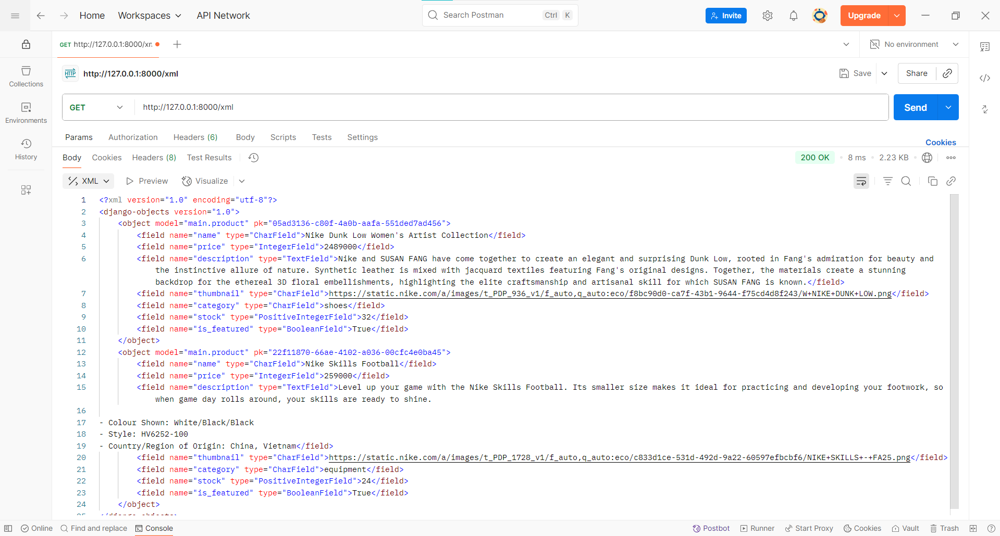
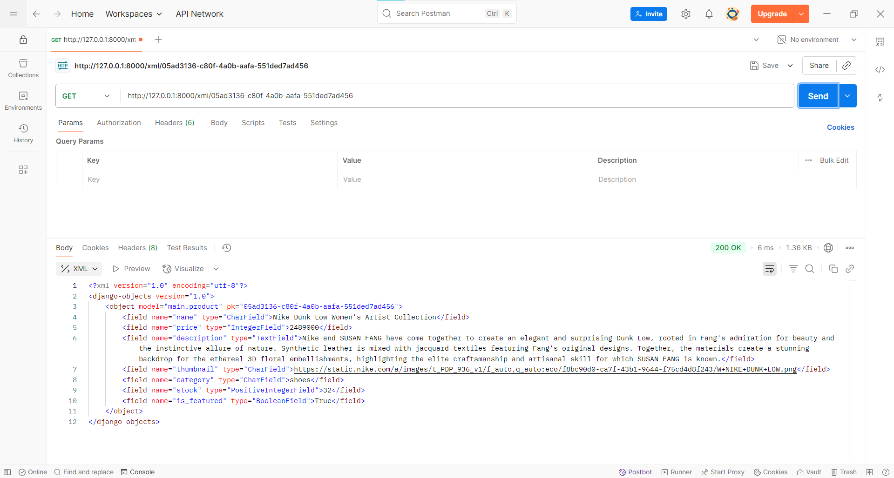
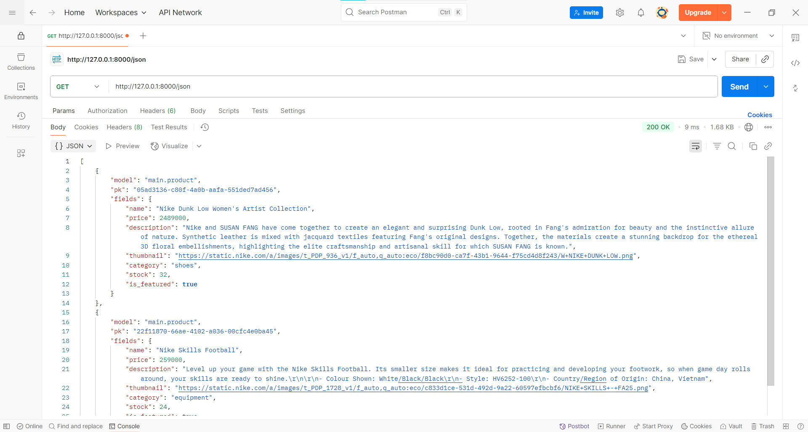
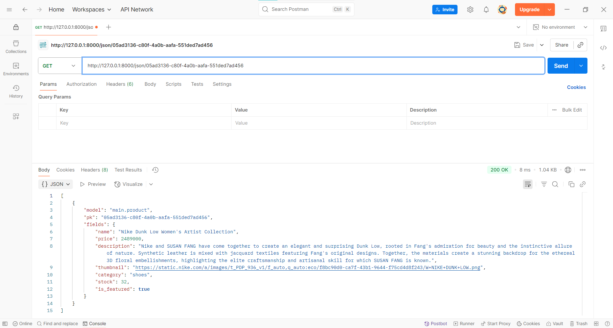

# The GOAL

---

## Assignment 2
> Implementation of Model-View-Template (MVT) in Django

#### Link to the deployed PWS application
[https://arisa-raezzura-thegoal.pbp.cs.ui.ac.id/](https://arisa-raezzura-thegoal.pbp.cs.ui.ac.id/)

#### Explain how you implemented the checklist above step-by-step

1. Open the command prompt and run `mkdir the_goal` to create a new directory. Then, run `cd the_goal` to enter it.

2. Create and activate an isolated virtual environment by entering

    ```
    python -m venv env
    env\Scripts\activate
    ```

3. In the current directory, create a `requirements.txt` file containing these dependencies:

    ```
    django
    gunicorn
    whitenoise
    psycopg2-binary
    requests
    urllib3
    python-dotenv
    ```

4. Install the dependency with this command

    ```
    pip install -r requirements.txt
    ```

5. Initialize a Django project by entering

    ```
    django-admin startproject the_goal .
    ```

6. In the same directory, create a `.env` file for local deployment. Add the given configuration.

    ```
    PRODUCTION=False
    ```

7. I\Still in the same directory, create a `.env.prod` file for production deployment configuration.

    ```
    DB_NAME=<database name>
    DB_HOST=<database host>
    DB_PORT=<database port>
    DB_USER=<database username>
    DB_PASSWORD=<database password>
    SCHEMA=tugas_individu
    PRODUCTION=True
    ```

8. Open `the_goal/settings.py` and insert the code below `import Path`.

    ```
    import os
    from dotenv import load_dotenv

    # Load environment variables from .env file
    load_dotenv()
    ```

9. Inside the same setting file, locate `ALLOWED_HOSTS` and add these strings inside the square brackets

    ```
    "localhost", "127.0.0.1"
    ```

10. Add this code right above the `DEBUG` section

    ```
    PRODUCTION = os.getenv('PRODUCTION', 'False').lower() == 'true'
    ```

11. Modify the database configuration in `settings.py` as follows:

    ```
    # Database configuration
    if PRODUCTION:
        # Production: use PostgreSQL with credentials from environment variables
        DATABASES = {
            'default': {
                'ENGINE': 'django.db.backends.postgresql',
                'NAME': os.getenv('DB_NAME'),
                'USER': os.getenv('DB_USER'),
                'PASSWORD': os.getenv('DB_PASSWORD'),
                'HOST': os.getenv('DB_HOST'),
                'PORT': os.getenv('DB_PORT'),
                'OPTIONS': {
                    'options': f"-c search_path={os.getenv('SCHEMA', 'public')}"
                }
            }
        }
    else:
        # Development: use SQLite
        DATABASES = {
            'default': {
                'ENGINE': 'django.db.backends.sqlite3',
                'NAME': BASE_DIR / 'db.sqlite3',
            }
        }
    ```

12. In the root directory of your project (the outer the_goal directory), migrate the database first using this command

    ```
    python manage.py migrate
    ```

13. Check if the Django server has already worked successfully by running the server using

    ```
    python manage.py runserver
    ```

14. Initialize a Git repository by entering `git init` inside the command prompt. Make sure to do it in the root directory (the outer `the_goal` directory)

15. Inside the outer directory of `the_goal`, create a `.gitignore` file and fill it with the following

    ```
    # Django
    *.log
    *.pot
    *.pyc
    **pycache**
    db.sqlite3
    media
    # Backup files
    *.bak
    # If you are using PyCharm
    # User-specific stuff
    .idea/**/workspace.xml
    .idea/**/tasks.xml
    .idea/**/usage.statistics.xml
    .idea/**/dictionaries
    .idea/**/shelf
    # AWS User-specific
    .idea/**/aws.xml
    # Generated files
    .idea/**/contentModel.xml
    .DS_Store
    # Sensitive or high-churn files
    .idea/**/dataSources/
    .idea/**/dataSources.ids
    .idea/**/dataSources.local.xml
    .idea/**/sqlDataSources.xml
    .idea/**/dynamic.xml
    .idea/**/uiDesigner.xml
    .idea/**/dbnavigator.xml
    # Gradle
    .idea/**/gradle.xml
    .idea/**/libraries
    # File-based project format
    *.iws
    # IntelliJ
    out/
    # JIRA plugin
    atlassian-ide-plugin.xml
    # Python
    *.py[cod]
    *$py.class
    # Distribution / packaging
    .Python build/
    develop-eggs/
    dist/
    downloads/
    eggs/
    .eggs/
    lib/
    lib64/
    parts/
    sdist/
    var/
    wheels/
    *.egg-info/
    .installed.cfg
    *.egg
    *.manifest
    *.spec
    # Installer logs
    pip-log.txt
    pip-delete-this-directory.txt
    # Unit test / coverage reports
    htmlcov/
    .tox/
    .coverage
    .coverage.*
    .cache
    .pytest_cache/
    nosetests.xml
    coverage.xml
    *.cover
    .hypothesis/
    # Jupyter Notebook
    .ipynb_checkpoints
    # pyenv
    .python-version
    # celery
    celerybeat-schedule.*
    # SageMath parsed files
    *.sage.py
    # Environments
    .env*
    !.env.example*
    .venv
    env/
    venv/
    ENV/
    env.bak/
    venv.bak/
    # mkdocs documentation
    /site
    # mypy
    .mypy_cache/
    # Sublime Text
    *.tmlanguage.cache
    *.tmPreferences.cache
    *.stTheme.cache
    *.sublime-workspace
    *.sublime-project
    # sftp configuration file
    sftp-config.json
    # Package control specific files Package
    Control.last-run
    Control.ca-list
    Control.ca-bundle
    Control.system-ca-bundle
    GitHub.sublime-settings
    # Visual Studio Code
    .vscode/*
    !.vscode/settings.json
    !.vscode/tasks.json
    !.vscode/launch.json
    !.vscode/extensions.json
    .history
    ```

16. Connect the local repository to the GitHub repo by using

    ```
    git remote add origin https://github.com/arisarae/the_goal.git
    ```

17. Create a main branch named `master`

    ```
    git branch -M master
    ```

18. Perform git add, commit, push at the terminal/command prompt of the local directory

    ```
    git add .
    git commit -m "initial commit: set up django"
    git push origin master
    ```

19. Deploy the project to PWS by opening [https://pbp.cs.ui.ac.id/web/](https://pbp.cs.ui.ac.id/web/), logging in, and clicking `Create New Project`

20. Filled the project name with `thegoal` and then clicked the `Create New Project` button

21. Save `username` and `password` credentials

22. On the sidebar, click the newly created project and open the `Environment` tab

23. Click the `Raw Editor` and paste the content of `.env.prod` of our project, then click `Update All Variables`

24. Go back to the `setting.py` inside the inner directory of `the_goal` and add this new string to the `ALLOWED_HOSTS`

    ```
    "arisa-raezzura-thegoal.pbp.cs.ui.ac.id"
    ```

25. Run the project command found before or check in the `Build` tab

26. Enter the credentials by using the `username` and `password` saved before

27. We can git add, commit, push again here using the commit message `chore: adding pws deployment url as allowed hosts`

28. After making sure the virtual environment inside the root directory is still active, create a new application named `main` using the command prompt

    ```
    python manage.py startapp main
    ```

29. Register the application to the project by adding `'main'` to the list of `INSTALLED_APPS` inside the `settings.py` in the `the_goal` project directory

30. Inside the `main` directory, create another directory named `templates` and add a new `main.html` file. Filled the file with the following code

    ```
    <h1>{{ app }}</h1>

    <h4>Name: </h4>
    <p>{{ name }}</p>
    <h4>Class: </h4>
    <p>{{ class }}</p>
    ```

31. Open the `models.py` file in the `main` directory and fill it with this code

    ```
    import uuid
    from django.db import models

    class Product(models.Model):
        CATEGORY_CHOICES = [
            ('shoes', 'Shoes'),
            ('clothing', 'Clothing'),
            ('equipment', 'Equipment'),
        ]

        id = models.UUIDField(primary_key=True, default=uuid.uuid4, editable=False)
        name = models.CharField(max_length=255)
        price = models.IntegerField(default=0)
        description = models.TextField()
        thumbnail = models.URLField(blank=True, null=True)
        category = models.CharField(max_length=20, choices=CATEGORY_CHOICES, default='equipment')
        stock = models.PositiveIntegerField(default=0)
        is_featured = models.BooleanField(default=False)

        def __str__(self):
            return self.name
    ```

32. Run these in the root directory terminal/command prompt to create and apply the model migration

    ```
    python manage.py makemigrations
    python manage.py migrate
    ```

33. Open the `views.py` located in the `main` application directory and modify its code to this

    ```
    from django.shortcuts import render

    # Create your views here
    def show_main(request):
        context = {
            'app' : 'The GOAL',
            'name': 'Arisa Raezzura Zahra',
            'class': 'PBD KKI'
        }

        return render(request, "main.html", context)
    ```

34. Create a `urls.py` file in the `main` directory and paste this code

    ```
    from django.urls import path
    from main.views import show_main

    app_name = 'main'

    urlpatterns = [
        path('', show_main, name='show_main'),
    ]
    ```

35. Open the `urls.py` file in `the_goal` inner project directory and modify it to this

    ```
    from django.contrib import admin
    from django.urls import path, include

    urlpatterns = [
        path('admin/', admin.site.urls),
        path('', include('main.urls')),
    ]
    ```

36. Save the changes and run these lines in the root directory command prompt

    ```
    git add .
    git commit -m "feat: create main app"
    git push origin master
    git push pws master
    ```

37. Create a `README.md` file in the root directory, fill it with the information needed, and do another git add, commit, push with the commit message `"docs: create README.md"`

#### Create a diagram showing the client request to the Django-based web application and its response, and explain the relationship between `urls.py`, `views.py`, `models.py`, and the HTML file in the diagram.



#### Explain the role of `settings.py` in a Django project!

`setting.py` is like the project's control center. It defines how the project behaves, holding all the key configurations necessary to manage the app’s behavior across development, testing, and production environments.

#### How does database migration work in Django?

Database migration refers to the process of transferring data from a source database to a target database. When this process is complete, the dataset from the source database will be entirely transferred to the target database.

#### In your opinion, among all existing frameworks, why is the Django framework chosen as the starting point for learning software development?

Since the main language used in Django is Python, which we are all already familiar with, we can focus on building and developing the application rather than doing it on top of learning a completely new language. Additionally, the Django framework offers both a frontend and a backend within a single application.

#### Do you have any feedback for the teaching assistant for Tutorial 1 that you previously completed?

I currently have no feedback for the TAs since they already helped us a lot during the Tutorial. For future tutorials, I hope they continue to do what they're doing now and help us when we encounter problems.

---

## Assignment 3

> Forms and Data Delivery Implementation in Django

#### Why do we need data delivery in implementing a platform?

To enhance personalization and user engagement on a platform, human interaction is essential. Such interaction frequently involves the transmission and reception of data. Data delivery ensures that the data stays consistent and synchronized across devices.

#### In your opinion, which is better, XML or JSON? Why is JSON more popular than XML?

In my opinion, JSON is preferable. XML is suitable for complex applications due to its robust validation features and use of attributes. However, JSON is favored for its lightweight nature and speed. Its native compatibility with JavaScript and ease of use also contribute to its greater popularity in recent applications over XML.

#### What is the purpose of the is_valid() method in Django forms, and why do we need it?

The is_valid() method ensures the data submitted by the user meets the validation rules and logic constraints. It returns a Boolean value, thus preventing invalid, incomplete, or unsafe data from being saved or processed.

#### Why do we need a csrf_token when making forms in Django? What can happen if we don't include a csrf_token in a Django form? How can this be exploited by an attacker?

Cross-Site Request Forgery (CSRF) is a type of cyberattack in which an attacker manipulates a user into performing unintended actions on a web application where they are already authenticated. The csrf_token protects against such threats by preventing malicious websites from submitting forms on behalf of authenticated users without their consent. Without this token, an application is exposed to CSRF attacks. For example, CSRF may be exploited to transfer funds without the user's knowledge, as the valid session allows the transaction to proceed as if authorized by the user.

#### Explain how you implemented the checklist above step-by-step (not just following the tutorial).

1. Create a new directory in the root directory named `templates` and add a `base.html` file containing this code

    ```
    
    <!DOCTYPE html>
    <html lang="en">

    <head>
        <meta charset="UTF-8" />
        <meta name="viewport" content="width=device-width, initial-scale=1.0" />
         
    </head>

    <body>
         
    </body>
    </html>
    ```

2. Open `settings.py` in the project directory (the inner `the-goal` directory) and edit the line containing the `TEMPLATES` variable

    ```
    ...
    TEMPLATES = [
        {
            'BACKEND': 'django.template.backends.django.DjangoTemplates',
            'DIRS': [BASE_DIR / 'templates'], # Add this line
            'APP_DIRS': True,
            ...
        }
    ]
    ...
    ```

3. Create a new file named `forms.py` in the `main` directory and add the following code

    ```
    from django.forms import ModelForm
    from main.models import Product

    class ProductForm(ModelForm):
        class Meta:
            model = Product
            fields = ["name", "price", "description", "thumbnail","category", "stock", "is_featured"]     
    ```

4. Modify the `views.py` file inside the `main` directory with the following code

    ```
    from django.shortcuts import render, redirect, get_object_or_404
    from main.forms import ProductForm
    from main.models import Product
    from django.http import HttpResponse
    from django.core import serializers

    def show_main(request):
        product_list = Product.objects.all()

        context = {
            'app' : 'The GOAL',
            'name': 'Arisa Raezzura Zahra',
            'class': 'PBD KKI',
            'product_list' : product_list
        }

        return render(request, "main.html", context)

    def create_product(request):
        form = ProductForm(request.POST or None)

        if form.is_valid() and request.method == "POST":
            form.save()
            return redirect('main:show_main')

        context = {'form': form}
        return render(request, "create_product.html", context)

    def show_product(request, id):
        product = get_object_or_404(Product, pk=id)

        context = {
            'product': product
        }

        return render(request, "product_detail.html", context)

    def show_xml(request):
        product_list = Product.objects.all()
        xml_data = serializers.serialize("xml", product_list)
        return HttpResponse(xml_data, content_type="application/xml")

    def show_json(request):
        product_list = Product.objects.all()
        json_data = serializers.serialize("json", product_list)
        return HttpResponse(json_data, content_type="application/json")

    def show_xml_by_id(request, id):
        try:
            product_item = Product.objects.filter(pk=id)
            xml_data = serializers.serialize("xml", product_item)
            return HttpResponse(xml_data, content_type="application/xml")
        except Product.DoesNotExist:
            return HttpResponse(status=404)

    def show_json_by_id(request, id):
        try:
            product_item = Product.objects.get(pk=id)
            json_data = serializers.serialize("json", [product_item])
            return HttpResponse(json_data, content_type="application/json")
        except Product.DoesNotExist:
            return HttpResponse(status=404)
    ```

5. Modify the `urls.py` file inside the `main` directory

    ```
    from django.urls import path
    from main.views import show_main, create_product, show_product, show_xml, show_json, show_xml_by_id, show_json_by_id

    app_name = 'main'

    urlpatterns = [
        path('', show_main, name='show_main'),
        path('create-product/', create_product, name='create_product'),
        path('product/<str:id>/', show_product, name='show_product'),
        path('xml/', show_xml, name='show_xml'),
        path('json/', show_json, name='show_json'),
        path('xml/<str:id>/', show_xml_by_id, name='show_xml_by_id'),
        path('json/<str:id>/', show_json_by_id, name='show_json_by_id'),
    ]
    ```

6. Modify `main.html` inside the `main` directory

    ```
    
    
    <h1>{{ app }}</h1>

    <h4>Name: </h4>
    <p>{{ name }}</p>
    <h4>Class: </h4>
    <p>{{ class }}</p>

    <a href="">
        <button>+ Add Product</button>
    </a>

    <hr>

    
    <p>No product data available.</p>

    
    
    <div>
        <h2><a href="">{{ product.name }}</a></h2>

        <p><b>{{ product.get_category_display }}</b> |
            <b>Featured</b>
            | Stock: {{ product.stock }}
        </p>

        
        
        <br />
        

        <p>{{ product.description|truncatewords:25 }}...</p>

        <p><a href=""><button>Read More</button></a></p>
    </div>

    <hr>
    
    
    
    ```

7. In the same directory, add two new files named `create_product.html` and `product_detail.html`

    **create_product.html**
    ```
    
    
    <h1>Add Product</h1>

    <form method="POST">
        
        <table>
            {{ form.as_table }}
            <tr>
                <td></td>
                <td>
                    <input type="submit" value="Add Product" />
                </td>
            </tr>
        </table>
    </form>
    
    ```

    **product_detail.html**
    ```
    
    
    <p><a href=""><button>← Back to Product List</button></a></p>

    <h1>{{ product.name }}</h1>
    <p><b>{{ product.get_category_display }}</b> |
        <b>Featured</b> | Stock: {{ product.stock }}
    </p>

    
    
    <br /><br />
    

    <p>{{ product.description }}</p>
    
    ```

8.  Open `setting.py` in the root directory (the outer `the-goal` directory) and add the following line under `ALLOWED_HOSTS`

    ```
    CSRF_TRUSTED_ORIGINS = ["https://arisa-raezzura-thegoal.pbp.cs.ui.ac.id"]
    ```

9. Save the changes and run these lines in the root directory command prompt

    ```
    git add .
    git commit -m "feat: applied forms and data delivery"
    git push origin master
    git push pws master
    ```

10. Modify a `README.md` file in the root directory, fill it with the information needed, and do another git add, commit, push with the commit message `"docs: update README.md - Assignment 3"`

#### Do you have any feedback for the teaching assistants for Tutorial 2?

Currently, no feedback for the TAs. They helped us a lot during the tutorial, and even corrected their mistakes on the website immediately after someone noticed them. 

#### Access the four URLs in point 2 using Postman, take screenshots of the URL access results in Postman.

**show_xml**


**show_xml_by_id**


**show_json**


**show_json_by_id**


