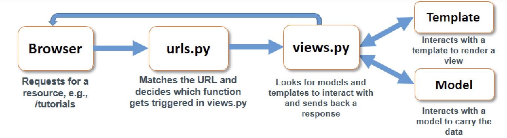
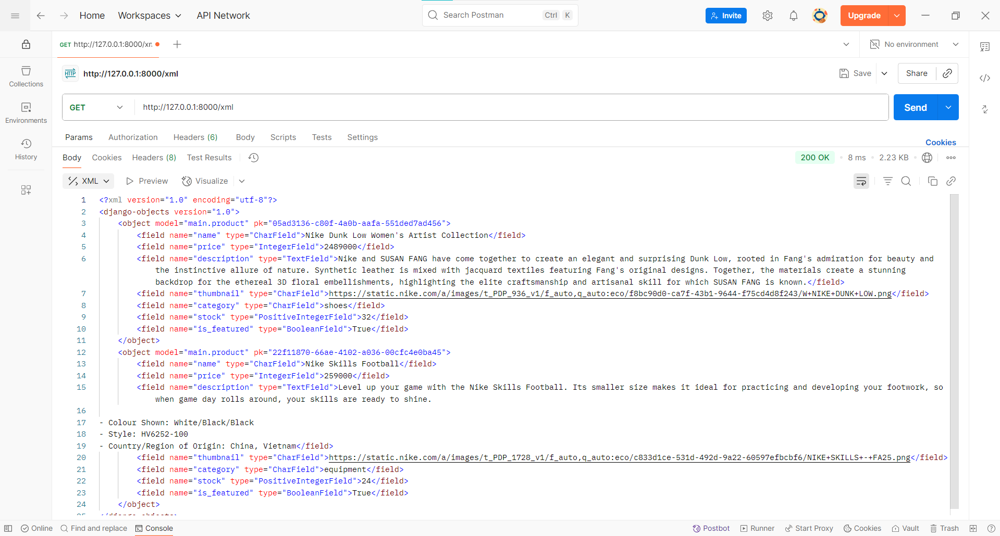
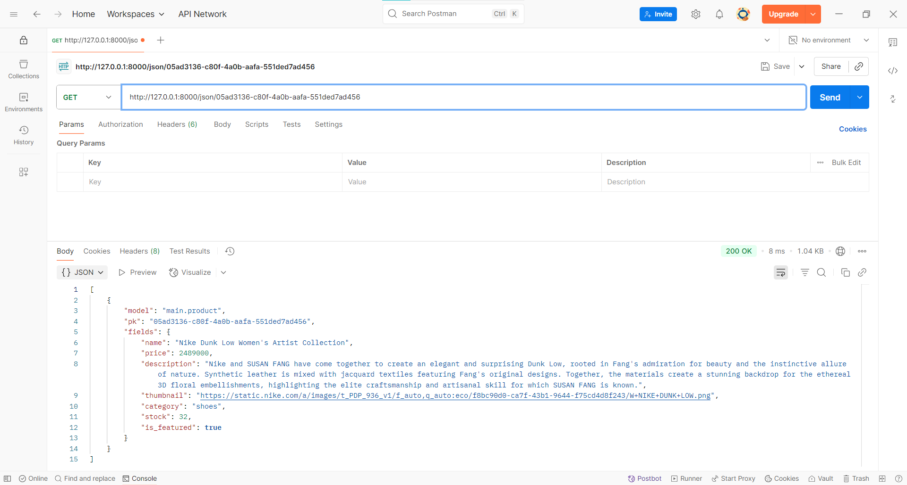
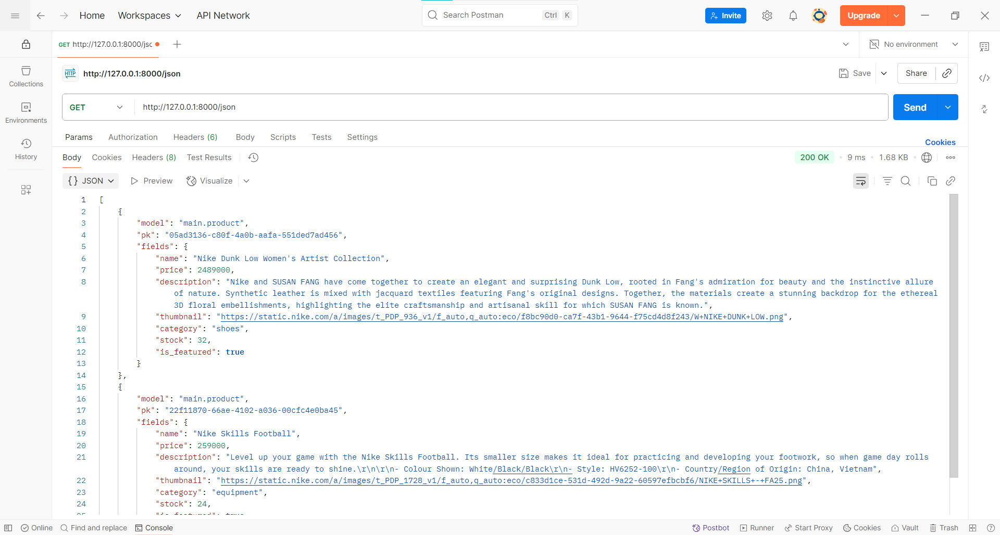

# The GOAL

## Assignment 2
> Implementation of Model-View-Template (MVT) in Django

### Link to the deployed PWS application
[https://arisa-raezzura-thegoal.pbp.cs.ui.ac.id/](https://arisa-raezzura-thegoal.pbp.cs.ui.ac.id/)

### Explain how you implemented the checklist above step-by-step

1. Open the command prompt and run `mkdir the_goal` to create a new directory. Then, run `cd the_goal` to enter it.

2. Create and activate an isolated virtual environment by entering

    ```
    python -m venv env
    env\Scripts\activate
    ```

3. In the current directory, create a `requirements.txt` file containing these dependencies:

    ```
    django
    gunicorn
    whitenoise
    psycopg2-binary
    requests
    urllib3
    python-dotenv
    ```

4. Install the dependency with this command

    ```
    pip install -r requirements.txt
    ```

5. Initialize a Django project by entering

    ```
    django-admin startproject the_goal .
    ```

6. In the same directory, create a `.env` file for local deployment. Add the given configuration.

    ```
    PRODUCTION=False
    ```

7. I\Still in the same directory, create a `.env.prod` file for production deployment configuration.

    ```
    DB_NAME=<database name>
    DB_HOST=<database host>
    DB_PORT=<database port>
    DB_USER=<database username>
    DB_PASSWORD=<database password>
    SCHEMA=tugas_individu
    PRODUCTION=True
    ```

8. Open `the_goal/settings.py` and insert the code below `import Path`.

    ```
    import os
    from dotenv import load_dotenv

    # Load environment variables from .env file
    load_dotenv()
    ```

9. Inside the same setting file, locate `ALLOWED_HOSTS` and add these strings inside the square brackets

    ```
    "localhost", "127.0.0.1"
    ```

10. Add this code right above the `DEBUG` section

    ```
    PRODUCTION = os.getenv('PRODUCTION', 'False').lower() == 'true'
    ```

11. Modify the database configuration in `settings.py` as follows:

    ```
    # Database configuration
    if PRODUCTION:
        # Production: use PostgreSQL with credentials from environment variables
        DATABASES = {
            'default': {
                'ENGINE': 'django.db.backends.postgresql',
                'NAME': os.getenv('DB_NAME'),
                'USER': os.getenv('DB_USER'),
                'PASSWORD': os.getenv('DB_PASSWORD'),
                'HOST': os.getenv('DB_HOST'),
                'PORT': os.getenv('DB_PORT'),
                'OPTIONS': {
                    'options': f"-c search_path={os.getenv('SCHEMA', 'public')}"
                }
            }
        }
    else:
        # Development: use SQLite
        DATABASES = {
            'default': {
                'ENGINE': 'django.db.backends.sqlite3',
                'NAME': BASE_DIR / 'db.sqlite3',
            }
        }
    ```

12. In the root directory of your project (the outer the_goal directory), migrate the database first using this command

    ```
    python manage.py migrate
    ```

13. Check if the Django server has already worked successfully by running the server using

    ```
    python manage.py runserver
    ```

14. Initialize a Git repository by entering `git init` inside the command prompt. Make sure to do it in the root directory (the outer `the_goal` directory)

15. Inside the outer directory of `the_goal`, create a `.gitignore` file and fill it with the following

    ```
    # Django
    *.log
    *.pot
    *.pyc
    **pycache**
    db.sqlite3
    media
    # Backup files
    *.bak
    # If you are using PyCharm
    # User-specific stuff
    .idea/**/workspace.xml
    .idea/**/tasks.xml
    .idea/**/usage.statistics.xml
    .idea/**/dictionaries
    .idea/**/shelf
    # AWS User-specific
    .idea/**/aws.xml
    # Generated files
    .idea/**/contentModel.xml
    .DS_Store
    # Sensitive or high-churn files
    .idea/**/dataSources/
    .idea/**/dataSources.ids
    .idea/**/dataSources.local.xml
    .idea/**/sqlDataSources.xml
    .idea/**/dynamic.xml
    .idea/**/uiDesigner.xml
    .idea/**/dbnavigator.xml
    # Gradle
    .idea/**/gradle.xml
    .idea/**/libraries
    # File-based project format
    *.iws
    # IntelliJ
    out/
    # JIRA plugin
    atlassian-ide-plugin.xml
    # Python
    *.py[cod]
    *$py.class
    # Distribution / packaging
    .Python build/
    develop-eggs/
    dist/
    downloads/
    eggs/
    .eggs/
    lib/
    lib64/
    parts/
    sdist/
    var/
    wheels/
    *.egg-info/
    .installed.cfg
    *.egg
    *.manifest
    *.spec
    # Installer logs
    pip-log.txt
    pip-delete-this-directory.txt
    # Unit test / coverage reports
    htmlcov/
    .tox/
    .coverage
    .coverage.*
    .cache
    .pytest_cache/
    nosetests.xml
    coverage.xml
    *.cover
    .hypothesis/
    # Jupyter Notebook
    .ipynb_checkpoints
    # pyenv
    .python-version
    # celery
    celerybeat-schedule.*
    # SageMath parsed files
    *.sage.py
    # Environments
    .env*
    !.env.example*
    .venv
    env/
    venv/
    ENV/
    env.bak/
    venv.bak/
    # mkdocs documentation
    /site
    # mypy
    .mypy_cache/
    # Sublime Text
    *.tmlanguage.cache
    *.tmPreferences.cache
    *.stTheme.cache
    *.sublime-workspace
    *.sublime-project
    # sftp configuration file
    sftp-config.json
    # Package control specific files Package
    Control.last-run
    Control.ca-list
    Control.ca-bundle
    Control.system-ca-bundle
    GitHub.sublime-settings
    # Visual Studio Code
    .vscode/*
    !.vscode/settings.json
    !.vscode/tasks.json
    !.vscode/launch.json
    !.vscode/extensions.json
    .history
    ```

16. Connect the local repository to the GitHub repo by using

    ```
    git remote add origin https://github.com/arisarae/the_goal.git
    ```

17. Create a main branch named `master`

    ```
    git branch -M master
    ```

18. Perform git add, commit, push at the terminal/command prompt of the local directory

    ```
    git add .
    git commit -m "initial commit: set up django"
    git push origin master
    ```

19. Deploy the project to PWS by opening [https://pbp.cs.ui.ac.id/web/](https://pbp.cs.ui.ac.id/web/), logging in, and clicking `Create New Project`

20. Filled the project name with `thegoal` and then clicked the `Create New Project` button

21. Save `username` and `password` credentials

22. On the sidebar, click the newly created project and open the `Environment` tab

23. Click the `Raw Editor` and paste the content of `.env.prod` of our project, then click `Update All Variables`

24. Go back to the `setting.py` inside the inner directory of `the_goal` and add this new string to the `ALLOWED_HOSTS`

    ```
    "arisa-raezzura-thegoal.pbp.cs.ui.ac.id"
    ```

25. Run the project command found before or check in the `Build` tab

26. Enter the credentials by using the `username` and `password` saved before

27. We can git add, commit, push again here using the commit message `chore: adding pws deployment url as allowed hosts`

28. After making sure the virtual environment inside the root directory is still active, create a new application named `main` using the command prompt

    ```
    python manage.py startapp main
    ```

29. Register the application to the project by adding `'main'` to the list of `INSTALLED_APPS` inside the `settings.py` in the `the_goal` project directory

30. Inside the `main` directory, create another directory named `templates` and add a new `main.html` file. Filled the file with the following code

    ```
    <h1>{{ app }}</h1>

    <h4>Name: </h4>
    <p>{{ name }}</p>
    <h4>Class: </h4>
    <p>{{ class }}</p>
    ```

31. Open the `models.py` file in the `main` directory and fill it with this code

    ```
    import uuid
    from django.db import models

    class Product(models.Model):
        CATEGORY_CHOICES = [
            ('shoes', 'Shoes'),
            ('clothing', 'Clothing'),
            ('equipment', 'Equipment'),
        ]

        id = models.UUIDField(primary_key=True, default=uuid.uuid4, editable=False)
        name = models.CharField(max_length=255)
        price = models.IntegerField(default=0)
        description = models.TextField()
        thumbnail = models.URLField(blank=True, null=True)
        category = models.CharField(max_length=20, choices=CATEGORY_CHOICES, default='equipment')
        stock = models.PositiveIntegerField(default=0)
        is_featured = models.BooleanField(default=False)

        def __str__(self):
            return self.name
    ```

32. Run these in the root directory terminal/command prompt to create and apply the model migration

    ```
    python manage.py makemigrations
    python manage.py migrate
    ```

33. Open the `views.py` located in the `main` application directory and modify its code to this

    ```
    from django.shortcuts import render

    # Create your views here
    def show_main(request):
        context = {
            'app' : 'The GOAL',
            'name': 'Arisa Raezzura Zahra',
            'class': 'PBD KKI'
        }

        return render(request, "main.html", context)
    ```

34. Create a `urls.py` file in the `main` directory and paste this code

    ```
    from django.urls import path
    from main.views import show_main

    app_name = 'main'

    urlpatterns = [
        path('', show_main, name='show_main'),
    ]
    ```

35. Open the `urls.py` file in `the_goal` inner project directory and modify it to this

    ```
    from django.contrib import admin
    from django.urls import path, include

    urlpatterns = [
        path('admin/', admin.site.urls),
        path('', include('main.urls')),
    ]
    ```

36. Save the changes and run these lines in the root directory command prompt

    ```
    git add .
    git commit -m "feat: create main app"
    git push origin master
    git push pws master
    ```

37. Create the `README.md` file in the root directory, fill it with the information needed, and do another git add, commit, push with the commit message `"docs: create README.md"`

### Create a diagram showing the client request to the Django-based web application and its response, and explain the relationship between `urls.py`, `views.py`, `models.py`, and the HTML file in the diagram.



### Explain the role of `settings.py` in a Django project!

`setting.py` is like the project's control center. It defines how the project behaves, holding all the key configurations necessary to manage the app’s behavior across development, testing, and production environments.

### How does database migration work in Django?

Database migration refers to the process of transferring data from a source database to a target database. When this process is complete, the dataset from the source database will be entirely transferred to the target database.

### In your opinion, among all existing frameworks, why is the Django framework chosen as the starting point for learning software development?

Since the main language used in Django is Python, which we are all already familiar with, we can focus on building and developing the application rather than doing it on top of learning a completely new language. Additionally, the Django framework offers both a frontend and a backend within a single application.

### Do you have any feedback for the teaching assistant for Tutorial 1 that you previously completed?

I currently have no feedback for the TAs since they already helped us a lot during the Tutorial. For future tutorials, I hope they continue to do what they're doing now and help us when we encounter problems.

---

## Assignment 3

> Forms and Data Delivery Implementation in Django

### Why do we need data delivery in implementing a platform?

To enhance personalization and user engagement on a platform, human interaction is essential. Such interaction frequently involves the transmission and reception of data. Data delivery ensures that the data stays consistent and synchronized across devices.

### In your opinion, which is better, XML or JSON? Why is JSON more popular than XML?

In my opinion, JSON is preferable. XML is suitable for complex applications due to its robust validation features and use of attributes. However, JSON is favored for its lightweight nature and speed. Its native compatibility with JavaScript and ease of use also contribute to its greater popularity in recent applications over XML.

### What is the purpose of the is_valid() method in Django forms, and why do we need it?

The is_valid() method ensures the data submitted by the user meets the validation rules and logic constraints. It returns a Boolean value, thus preventing invalid, incomplete, or unsafe data from being saved or processed.

### Why do we need a csrf_token when making forms in Django? What can happen if we don't include a csrf_token in a Django form? How can this be exploited by an attacker?

Cross-Site Request Forgery (CSRF) is a type of cyberattack in which an attacker manipulates a user into performing unintended actions on a web application where they are already authenticated. The csrf_token protects against such threats by preventing malicious websites from submitting forms on behalf of authenticated users without their consent. Without this token, an application is exposed to CSRF attacks. For example, CSRF may be exploited to transfer funds without the user's knowledge, as the valid session allows the transaction to proceed as if authorized by the user.

### Explain how you implemented the checklist above step-by-step (not just following the tutorial).

1. Create a new directory in the root directory named `templates` and add a `base.html` file containing this code

    ```
    
    <!DOCTYPE html>
    <html lang="en">

    <head>
        <meta charset="UTF-8" />
        <meta name="viewport" content="width=device-width, initial-scale=1.0" />
         
    </head>

    <body>
         
    </body>
    </html>
    ```

2. Open `settings.py` in the project directory (the inner `the-goal` directory) and edit the line containing the `TEMPLATES` variable

    ```
    ...
    TEMPLATES = [
        {
            'BACKEND': 'django.template.backends.django.DjangoTemplates',
            'DIRS': [BASE_DIR / 'templates'], # Add this line
            'APP_DIRS': True,
            ...
        }
    ]
    ...
    ```

3. Create a new file named `forms.py` in the `main` directory and add the following code

    ```
    from django.forms import ModelForm
    from main.models import Product

    class ProductForm(ModelForm):
        class Meta:
            model = Product
            fields = ["name", "price", "description", "thumbnail","category", "stock", "is_featured"]     
    ```

4. Modify the `views.py` file inside the `main` directory with the following code

    ```
    from django.shortcuts import render, redirect, get_object_or_404
    from main.forms import ProductForm
    from main.models import Product
    from django.http import HttpResponse
    from django.core import serializers

    def show_main(request):
        product_list = Product.objects.all()

        context = {
            'app' : 'The GOAL',
            'name': 'Arisa Raezzura Zahra',
            'class': 'PBD KKI',
            'product_list' : product_list
        }

        return render(request, "main.html", context)

    def create_product(request):
        form = ProductForm(request.POST or None)

        if form.is_valid() and request.method == "POST":
            product_entry = form.save(commit = False)
            product_entry.user = request.user
            product_entry.save()
            return redirect('main:show_main')

        context = {'form': form}
        return render(request, "create_product.html", context)

    def show_product(request, id):
        product = get_object_or_404(Product, pk=id)

        context = {
            'product': product
        }

        return render(request, "product_detail.html", context)

    def show_xml(request):
        product_list = Product.objects.all()
        xml_data = serializers.serialize("xml", product_list)
        return HttpResponse(xml_data, content_type="application/xml")

    def show_json(request):
        product_list = Product.objects.all()
        json_data = serializers.serialize("json", product_list)
        return HttpResponse(json_data, content_type="application/json")

    def show_xml_by_id(request, id):
        try:
            product_item = Product.objects.filter(pk=id)
            xml_data = serializers.serialize("xml", product_item)
            return HttpResponse(xml_data, content_type="application/xml")
        except Product.DoesNotExist:
            return HttpResponse(status=404)

    def show_json_by_id(request, id):
        try:
            product_item = Product.objects.get(pk=id)
            json_data = serializers.serialize("json", [product_item])
            return HttpResponse(json_data, content_type="application/json")
        except Product.DoesNotExist:
            return HttpResponse(status=404)
    ```

5. Modify the `urls.py` file inside the `main` directory

    ```
    from django.urls import path
    from main.views import show_main, create_product, show_product, show_xml, show_json, show_xml_by_id, show_json_by_id

    app_name = 'main'

    urlpatterns = [
        path('', show_main, name='show_main'),
        path('create-product/', create_product, name='create_product'),
        path('product/<str:id>/', show_product, name='show_product'),
        path('xml/', show_xml, name='show_xml'),
        path('json/', show_json, name='show_json'),
        path('xml/<str:id>/', show_xml_by_id, name='show_xml_by_id'),
        path('json/<str:id>/', show_json_by_id, name='show_json_by_id'),
    ]
    ```

6. Modify `main.html` inside the `main` directory

    ```
    
    
    <h1>{{ app }}</h1>

    <h4>Name: </h4>
    <p>{{ name }}</p>
    <h4>Class: </h4>
    <p>{{ class }}</p>

    <a href="">
        <button>+ Add Product</button>
    </a>

    <hr>

    
    <p>No product data available.</p>

    
    
    <div>
        <h2><a href="">{{ product.name }}</a></h2>

        <p><b>{{ product.get_category_display }}</b> |
            <b>Featured</b>
            | Stock: {{ product.stock }}
        </p>

        
        
        <br />
        

        <p>{{ product.description|truncatewords:25 }}...</p>

        <p><a href=""><button>Read More</button></a></p>
    </div>

    <hr>
    
    
    
    ```

7. In the same directory, add two new files named `create_product.html` and `product_detail.html`

    **create_product.html**
    ```
    
    
    <h1>Add Product</h1>

    <form method="POST">
        
        <table>
            {{ form.as_table }}
            <tr>
                <td></td>
                <td>
                    <input type="submit" value="Add Product" />
                </td>
            </tr>
        </table>
    </form>
    
    ```

    **product_detail.html**
    ```
    
    
    <p><a href=""><button>← Back to Product List</button></a></p>

    <h1>{{ product.name }}</h1>
    <p><b>{{ product.get_category_display }}</b> |
        <b>Featured</b> | Stock: {{ product.stock }}
    </p>

    
    
    <br /><br />
    

    <p>{{ product.description }}</p>
    
    ```

8.  Open `setting.py` in the root directory (the outer `the-goal` directory) and add the following line under `ALLOWED_HOSTS`

    ```
    CSRF_TRUSTED_ORIGINS = ["https://arisa-raezzura-thegoal.pbp.cs.ui.ac.id"]
    ```

9. Save the changes and run these lines in the root directory command prompt

    ```
    git add .
    git commit -m "feat: applied forms and data delivery"
    git push origin master
    git push pws master
    ```

10. Modify the `README.md` file in the root directory, fill it with the information needed, and do another git add, commit, push with the commit message `"docs: update README.md - Assignment 3"`

### Do you have any feedback for the teaching assistants for Tutorial 2?

Currently, no feedback for the TAs. They helped us a lot during the tutorial, and even corrected their mistakes on the website immediately after someone noticed them. 

### Access the four URLs in point 2 using Postman, take screenshots of the URL access results in Postman.

**show_xml**


**show_xml_by_id**


**show_json**


**show_json_by_id**


---

## Assignment 4

> Implementing Authentication, Session, and Cookies in Django

### What is Django's AuthenticationForm? Explain its advantages and disadvantages.

AuthenticationForm is a built-in form in Django that handles user login using username and password. It validates the credentials and returns the logged-in user if the credentials are correct. It's easy to use and integrates well with Django's authentication system, while still maintaining security purposes. The disadvantages are that it only supports basic username/password login by default, so customizing email login or two-factor authentication requires extra work.

### What is the difference between authentication and authorization? How does Django implement the two concepts?

Authentication is used to verify the identity of the user. In Django, this is managed by User from django.contrib.auth.model, authentication backends, and login()/logout() functions.
Authorization determines what an authenticated user can access or do. A way to apply this is by using decorators such as @login_required.

### What are the benefits and drawbacks of using sessions and cookies in storing the state of a web application?

Cookies only store a small piece of data on the client's side of the browser. This makes it simple and persistent, but it is limited in size and can be easily tampered with without proper security. While sessions only store the session ID in the client’s cookie, the actual data is kept securely on the server. It is more secure and flexible, but requires server storage and more setup. 

### In web development, is the usage of cookies secure by default, or is there any potential risk that we should be aware of? How does Django handle this problem?

Cookies are not fully secure by default because they can be stolen through attacks like XSS or intercepted if sent over HTTP. Django mitigates this risk by providing settings such as HttpOnly, Secure, and SameSite for session and CSRF cookies, ensuring they are only sent over HTTPS, inaccessible to JavaScript, and protected from cross-site requests. Django also uses CSRF tokens and rotates session keys after login to prevent common attacks.

### Explain how you implemented the checklist above step-by-step (not just following the tutorial).
1. Create 2 new HTML templates named `register.html` and `login.html` in the `main/templates` folder and fill them with the following code:

    **register.html**
    ```
    
    
    <title>Register</title>
    

    
    <div>
        <h1>Register</h1>

        <form method="POST">
            
            <table>
                {{ form.as_table }}
                <tr>
                    <td></td>
                    <td><input type="submit" name="submit" value="Register" /></td>
                </tr>
            </table>
        </form>

        
        <ul>
            
            <li>{{ message }}</li>
            
        </ul>
        
    </div>
    
    ```

    **login.html**
    ```
    
    
    <title>Login</title>
    

    
    <div class="login">
        <h1>Login</h1>

        <form method="POST" action="">
            
            <table>
                {{ form.as_table }}
                <tr>
                    <td></td>
                    <td><input class="btn login_btn" type="submit" value="Login" /></td>
                </tr>
            </table>
        </form>

        
        <ul>
            
            <li>{{ message }}</li>
            
        </ul>
         Don't have an account yet?
        <a href="">Register Now</a>
    </div>
    
    ```

2. Modify the `main.html` file in the same directory. Add the following code after the name and class information, but before the product list.

    ```
    ...

    <a href="">
        <button>Logout</button>
    </a>

    <h5>Last login session: {{ last_login }}</h5>

    <a href="">
        <button>+ Add Product</button>
    </a>

    <a href="?filter=all">
        <button type="button">All Product</button>
    </a>

    <a href="?filter=my">
        <button type="button">My Product</button>
    </a>

    ...
    ```

3. Modify the `product_detail.html` by adding the snippet below at the very end, just before ``.
    
    ```
    
    <p>Brand: {{ product.user.username }}</p>
    
    <p>Brand: Anonymous</p>
    
    ```

4. Modify the `views.py` file in the `main` directory by adding these import statements.

    ```
    from django.http import HttpResponse, HttpResponseRedirect
    from django.urls import reverse
    from django.contrib import messages
    from django.contrib.auth import authenticate, login, logout
    from django.contrib.auth.forms import UserCreationForm, AuthenticationForm
    from django.contrib.auth.decorators import login_required
    import datetime
    ```

5. Add a new `register()`, `login_user()`, and `logout_user()` function in the same file.

    ```
    def register(request):
        form = UserCreationForm()

        if request.method == "POST":
            form = UserCreationForm(request.POST)
            if form.is_valid():
                form.save()
                messages.success(request, 'Your account has been successfully created!')
                return redirect('main:login')
        
        context = {'form':form}
        return render(request, 'register.html', context)

    def login_user(request):
        if request.method == 'POST':
            form = AuthenticationForm(data=request.POST)
            if form.is_valid():
                user = form.get_user()
                login(request, user)
                response = HttpResponseRedirect(reverse("main:show_main"))
                response.set_cookie('last_login', str(datetime.datetime.now()))
                return response
        else:
            form = AuthenticationForm(request)
    
        context = {'form': form}
        return render(request, 'login.html', context)

    def logout_user(request):
        logout(request)
        response = HttpResponseRedirect(reverse('main:login'))
        response.delete_cookie('last_login')
        return response
    ```

6. Add this line on top of the function where we want it to be authorized by authenticated users only. For this project, apply it to `show_main()`, `create_product()`, and `show_product()`.

    ```
    @login_required(login_url='/login')
    ```

7. Modify the `show_main()` function to this code.
    
    ```
    def show_main(request):
        filter_type = request.GET.get("filter", "all")  # default 'all'

        if filter_type == "all":
            product_list = Product.objects.all()
        else:
            product_list = Product.objects.filter(user=request.user)

        context = {
            'app' : 'The GOAL',
            'name': 'Arisa Raezzura Zahra',
            'class': 'PBD KKI',
            'product_list' : product_list,
            'last_login': request.COOKIES.get('last_login', 'Never')
        }
    ```

8. Modify the import `urls.py` of the same `main` directory with this code.
    
    ```
    from django.urls import path
    from main.views import register, login_user, logout_user, show_main, create_product, show_product, show_xml, show_json, show_xml_by_id, show_json_by_id

    app_name = 'main'

    urlpatterns = [
        path('', show_main, name='show_main'),
        path('register/', register, name='register'),
        path('login/', login_user, name='login'),
        path('logout/', logout_user, name='logout'),
        path('create-product/', create_product, name='create_product'),
        path('product/<str:id>/', show_product, name='show_product'),
        path('xml/', show_xml, name='show_xml'),
        path('json/', show_json, name='show_json'),
        path('xml/<str:id>/', show_xml_by_id, name='show_xml_by_id'),
        path('json/<str:id>/', show_json_by_id, name='show_json_by_id'),
    ]
    ```

9. Modify the `models.py` by adding a new import and a new `user` field.
    
    ```
    ...
    from django.contrib.auth.models import User

    class Product(models.Model):
        ...

        user = models.ForeignKey(User, on_delete=models.CASCADE, null=True)

        ...
    ```

10. Create the model migration file with `python manage.py makemigrations`. Then run model migration with `python manage.py migrate`.

11. Save the changes and run these lines in the root directory command prompt

    ```
    git add .
    git commit -m "feat: applied authentication, authorization, and session"
    git push origin master
    git push pws master
    ```

12. Create 2 dummy account by registering it directly to the deployed website. 

13. Log in to the accounts and create 3 product each using `Add Product`.

14. Modify the `README.md` file in the root directory, fill it with the information needed, and do another git add, commit, push with the commit message `"docs: update README.md - Assignment 4"`

---

## Assignment 4

> Web Design using HTML, CSS and CSS Framework

### If multiple CSS selectors target an HTML element, explain the priority order for CSS selector selection.

When multiple CSS rules apply to the same element, browsers use a priority system called specificity. Inline styles (`style=""`) have the highest priority, followed by external style sheets and then internal style sheets. In the CSS itself, IDs (`#id`) have the highest priority, then classes/attributes/pseudo-classes (`.class`, `[attr]`, `:hover`), and lastly element selectors (`div`, `p`, etc.). If two rules have the same specificity, the one written last in the CSS file will be applied. If no rules are applied, it will follow the browser default.

### Why is responsive design important in web application development?

Responsive design enables web pages to adjust smoothly to various screen sizes, including phones, tablets, and desktops. It is important because users nowadays access apps on many devices, and a poor layout can make an app hard to use.

### Provide examples of applications that have and haven't implemented responsive design. Explain the reasons behind your examples.

Instagram and YouTube are highly responsive, offering a seamless experience on both mobile and desktop. On the other hand, some older government websites or university portals (for example, SIAK NG) often lack responsiveness, forcing users to zoom in or scroll sideways. The difference lies in modern apps prioritizing mobile usability, whereas older ones may have been built only for a specific screen.

### Explain the differences between margin, border, and padding, and how to implement them

The CSS box model defines how elements are spaced on a page. Margin is the space outside the element, creating distance between it and other elements. Border wraps around the element’s content and padding, acting like a frame. Padding is the space inside the element, between the content and the border.

### Explain the concepts of flexbox and grid layout along with their uses

Flexbox is a one-dimensional layout system useful for arranging items in a row or column, such as navigation bars or aligning buttons. It provides flexibility in spacing and alignment. CSS Grid is a two-dimensional layout system that enables the precise placement of items in rows and columns, making it ideal for page structures such as dashboards or galleries. Flexbox is best suited for linear alignment, while Grid is more suitable for full-page or complex layouts.

### Explain how you implemented the above checklist step-by-step (not just following the tutorial)
1. Open `base.html` and add the following tag to the head to make the website adjustable to mobile size and behaviour, and to use Tailwind CSS.

    ```
    <head>
        <meta charset="UTF-8" />
        <meta name="viewport" content="width=device-width, initial-scale=1.0" />
         
        <script src="https://cdn.tailwindcss.com"></script>
        <link rel="stylesheet" href="" />
    </head>
    ```

2. Create a new HTML file named `edit_product.html` in the `main/templates`. Fill it with the following code,

    ```
    
    
    
    <h1>Edit Product</h1>

    <form method="POST">
        
        <table>
            {{ form.as_table }}
            <tr>
                <td></td>
                <td>
                    <input type="submit" value="Edit Product"/>
                </td>
            </tr>
        </table>
    </form>
    
    ```

3. Create 2 new function in `main/views.py` named `edit_product()` and `delete_product()` as follow,
    
    ```
    @login_required(login_url='/login')
    def edit_product(request, id):
        product = get_object_or_404(Product, pk=id)
        form = ProductForm(request.POST or None, instance=product)
        if form.is_valid() and request.method == 'POST':
            form.save()
            return redirect('main:show_main')

        context = {
            'form': form
        }

        return render(request, "edit_product.html", context)

    def delete_product(request, id):
        product = get_object_or_404(Product, pk=id)
        product.delete()
        return HttpResponseRedirect(reverse('main:show_main'))
    ```

4. Open `urls.py` and add the new function to the import and urlpatterns.
    
    ```
    ...
    
    from main.views import edit_product, delete_product,
    ...
        
    urlpatterns = [
        ...

        path('product/<uuid:id>/edit', edit_product, name='edit_product'),
        path('product/<uuid:id>/delete', delete_product, name='delete_product'),
        ...
    ]
    ```

5. Open `main.html` and add the edit and delete buttons.
    
    ```
    ...

    <p>
        <a href=""><button>Read More</button></a>
        
        <a href="">
            <button>
                Edit
            </button>
        </a>
        <a href="">
            <button>
                Delete
            </button>
        </a>
        
    </p>
    ...
    ```

6. In the root `template` directory, make a new `navbar.html` and fill it with this code,

    ```
    <nav>
        <h1>The GOAL</h1>

        <ul>
            <li><a href="/">Home</a></li>
            <li><a href="">Create Product</a></li>
        </ul>

        
            <div>
            <span>Welcome, {{ name|default:user.username }}</span>
            <span>{{ npm|default:"Student" }} - {{ class|default:"Class" }}</span>
            <a href="">Logout</a>
            </div>
        
            <div>
            <a href="">Login</a>
            <a href="">Register</a>
            </div>
        
    </nav>
    ```

7. Link the navbar to the `main.html` in the `main/template` directory.
    
    ```
    
    
    
    
    ...
    
    
    ```

8. Open `settings.py` inside the `the_goal` project directory and add a new WhiteNoiseMiddleware right below the SecurityMiddleware.

    ```
    ...
    
    MIDDLEWARE = [
        'django.middleware.security.SecurityMiddleware',
        'whitenoise.middleware.WhiteNoiseMiddleware',
        
        ...
    ]
    
    ...
    ```

9. In the same file, add the following code under `STATIC_URL`.

    ```
    if DEBUG:
        STATICFILES_DIRS = [
            BASE_DIR / 'static' # refers to /static root project in development mode
        ]
    else:
        STATIC_ROOT = BASE_DIR / 'static' # refers to /static root project in production mode
    ```

10. Create a new folder called `static` in the root and make a `css` folder in it. Fill the folder with `global.css`. Modify the file to add a custom design to the project.

11. Create a new HTML for the product card inside `main/template` and fill it with this code.
    
    ```
    
    <article
        class="bg-white rounded-lg border border-gray-200 hover:shadow-lg transition-shadow duration-300 overflow-hidden h-fit">
        <!-- Thumbnail -->
        <div class="aspect-[16/9] relative overflow-hidden">
            
            
            
            <div class="w-full h-full bg-gray-200"></div>
            

            <!-- Status Badges -->
            <div class="absolute top-3 right-3 flex space-x-2">
                
                <span class="inline-flex items-center px-2 py-1 rounded text-xs font-medium bg-yellow-100 text-yellow-800">
                    Featured
                </span>
                
            </div>
        </div>

        <!-- Description -->
        <div class="p-5">
            <h3 class="text-xl font-semibold text-gray-900 mb-1 line-clamp-2 leading-tight">
                <a href="" class="hover:text-green-600 transition-colors font-bold">
                    {{ product.name }}
                </a>
            </h3>

            <p class="text-gray-600 text-sm leading-relaxed line-clamp-3 mb-2">
                {{ product.get_category_display }}
            </p>

            <p class="text-gray-900 text-lg leading-relaxed line-clamp-3 mb-4">
                Only at <span class="text-red-700 font-bold">Rp {{ product.price }}</span>
            </p>


            <!-- Action Buttons -->
            
            <div class="flex items-center justify-between pt-4 border-t border-gray-100">
                <a href=""
                    class="text-green-600 hover:text-green-700 font-medium text-sm transition-colors">
                    See Detail →
                </a>
                <div class="flex space-x-2">
                    <a href=""
                        class="text-gray-600 hover:text-gray-700 text-sm transition-colors">
                        Edit
                    </a>
                    <a href=""
                        class="text-red-600 hover:text-red-700 text-sm transition-colors">
                        Delete
                    </a>
                </div>
            </div>
            
            <div class="pt-4 border-t border-gray-100">
                <a href=""
                    class="text-green-600 hover:text-green-700 font-medium text-sm transition-colors">
                    See Detail →
                </a>
            </div>
            
        </div>
    </article>
    ```

12. To use a display image when the product is still empty, make a new folder named `image` inside the `static` directory. Add the `no-product.jpg` image inside it. The use of the image and product card is demonstrated in this code. Put it after the filter section.

    ```
    
        <div>
            
            <h3>No product found</h3>
            <p>Create your own product and be The GOAL!</p>
            <a>Create Product</a>
        </div>
    
        
            
        
    
    ```

13. Modify the other HTML file with Tailwind by adding `class` inside each tag and fill it with the desired design. Tailwind documentation can be seen [here](https://tailwindcss.com/docs/installation/using-vite)

14. Save the changes and run these lines in the root directory command prompt.

    ```
    git add .
    git commit -m "feat: implement update and delete methods on data, design web using tailwind css"
    git push origin master
    git push pws master
    ```

15. Modify the `README.md` file in the root directory, fill it with the information needed, and do another git add, commit, push with the commit message `"docs: update README.md - Assignment 5"`

## Assignment 5
### What is the difference between synchronous request and asynchronous request?

A synchronous request waits for the server to respond before continuing, so the page freezes or reloads first during the process. Meanwhile, asynchronous request allows the page to keep running while waiting for the server’s response, so users can still interact with other parts of the site without interruption.

### How does AJAX work in Django (request–response flow)?

AJAX (Asynchronous JavaScript and XML) sends data to the Django server in the background without reloading the page. When a user triggers an event such as submitting a form, JavaScript sends an AJAX request to a Django view (often through a URL mapped in urls.py). The view processes the data and returns a JSON response. JavaScript then updates part of the webpage dynamically using the response without needing full page reload.

### What are the advantages of using AJAX compared to regular rendering in Django?

- Since only parts of the page are updated, load time reduced significantly.
- No full-page reloads making the interactions feel more seamless.
- Less data is transferred compared to re-rendering entire pages.
- Ideal for features like live search, chat, or real-time notifications.

### How do you ensure security when using AJAX for Login and Register features in Django?

To keep AJAX requests secure, Django uses CSRF tokens for protection against cross-site request forgery. All data should be validated on the server side to prevent bypassing security checks. Use HTTPS to protect sensitive data like passwords, and ensure proper authentication and permission checks in the Django views.

### How does AJAX affect user experience (UX) on websites?

AJAX improves UX by making web apps feel faster and more interactive. Users don’t have to wait for full page to reloads after each action, making the site feel more like a modern application. For example, typing in a search box can show instant results, or liking a post can update the count immediately without leaving or reloading the page.